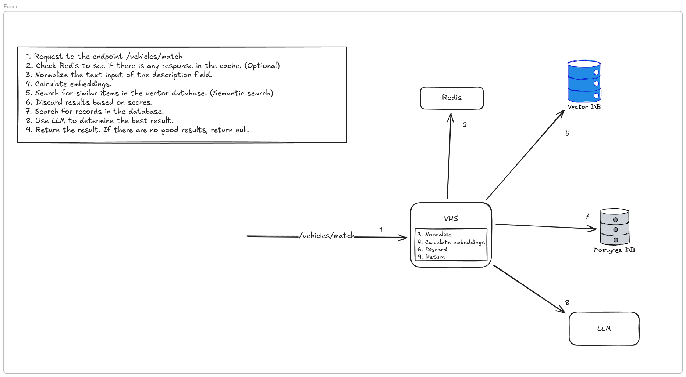

# Vehicle Homologation System

A vehicle matching system that uses vector similarity search and LLM-powered disambiguation to match vehicle descriptions to a standardized vehicle catalog.

## Table of Contents

- [Problem Statement](#problem-statement)
- [Solution Architecture](#solution-architecture)
- [Design Decisions](#design-decisions)
- [Prerequisites](#prerequisites)
- [Installation](#installation)
- [API Endpoints](#api-endpoints)
  - [Match Endpoint](#match-endpoint)
  - [Batch Match Endpoint](#batch-match-endpoint)
- [Matching Rules](#matching-rules)
- [Examples](#examples)

---

## Problem Statement

### The Homologation Challenge

Crabi is a Mexican vehicle insurance company operating with a B2B model, where external partners (dealerships, automotive agencies, car sales platforms) quote and issue insurance policies through Crabi's API.

**The core problem**: Each partner has their own vehicle database with different naming conventions, but they all need to match to Crabi's standardized catalog.

### Real-World Example

The same vehicle can be described in completely different ways by different partners:

| Source | Vehicle Description |
|--------|---------------------|
| **Partner A** | `RENAULT MEGANE 1.6 COMFORT MT 2009, 108CV, SEDAN, COMBUSTION, MT` |
| **Partner B** | `Renault Megane Comfort Manual 1.6L 2009 Sedán` |
| **Partner C** | `MEGANE COMFORT 2009 1600CC MT 4 PUERTAS` |
| **Crabi Catalog** | `Renault Megane Comfort 1.6 MT 2009, SEDAN, 108HP, COMBUSTION` → **ID: VEH123** |

### Why Is This Critical?

- **Wrong mapping** = Policy issued for the wrong vehicle
- **Financial impact** = Incorrect premium calculation
- **Legal risk** = Invalid coverage and legal validity issues
- **Operational cost** = Manual mappings are slow and expensive

### Technical Challenges

| Challenge | Description |
|-----------|-------------|
| **Format variations** | Different orders, abbreviations, Spanish/English terms |
| **Redundant information** | Repeated data or concatenated fields |
| **Missing information** | Some partners omit fields |
| **Synonyms** | "MT" vs "Manual", "Sedán" vs "SEDAN", "CV" vs "HP" |
| **Ambiguity** | Multiple versions of the same model with similar specs |

---

## Solution Architecture

This system uses a hybrid approach combining **semantic search** with **LLM disambiguation** to accurately match vehicle descriptions.

### Flow Diagram



### Processing Steps

| Step | Component | Description |
|------|-----------|-------------|
| **1** | API Endpoint | Request arrives at `/vehicles/match` |
| **2** | Redis Cache | Check if response exists in cache *(Optional)* |
| **3** | Normalization | Standardize the text input (uppercase, remove duplicates, etc.) |
| **4** | Embeddings | Calculate vector embeddings using HuggingFace model |
| **5** | Vector DB | Search for similar items in Upstash Vector (semantic search) |
| **6** | Score Filter | Discard results below similarity thresholds |
| **7** | PostgreSQL | Fetch full vehicle records from database |
| **8** | LLM | Use Gemini to determine the best match among candidates |
| **9** | Response | Return the matched `id_crabi` or `null` if no confident match |

### Key Components

```
┌─────────────────────────────────────────────────────────────────────────┐
│                              VHS (Vehicle Homologation System)          │
├─────────────────────────────────────────────────────────────────────────┤
│  • Normalization Service  - Standardizes input text                     │
│  • Embedding Service      - Calculates vector embeddings                │
│  • Vector Service         - Queries Upstash for similar vehicles        │
│  • LLM Service            - Disambiguates between multiple candidates   │
│  • Vehicle Service        - Orchestrates the matching flow              │
└─────────────────────────────────────────────────────────────────────────┘
         │                    │                    │
         ▼                    ▼                    ▼
   ┌──────────┐        ┌──────────────┐      ┌──────────┐
   │  Redis   │        │  Upstash     │      │ Postgres │
   │  Cache   │        │  Vector DB   │      │    DB    │
   └──────────┘        └──────────────┘      └──────────┘
                              │
                              ▼
                       ┌──────────────┐
                       │   Gemini     │
                       │     LLM      │
                       └──────────────┘
```

---

## Design Decisions

This section explains the rationale behind the key technical decisions made for this solution.

### 1. Why a Vector Database?

We chose a vector database to enable **semantic search**. Traditional keyword-based searching would not work for this problem because:

- It lacks flexibility to handle variations in terminology
- It doesn't understand context or meaning
- Exact matches would fail for synonyms like "MT" vs "Manual" or "CV" vs "HP"

Vector databases allow us to find semantically similar descriptions even when the exact words differ.

### 2. Vector Database Provider

The vector database provider could be any provider that supports similarity search. Alternatives include:

- **PostgreSQL with pgvector extension** - Good for keeping everything in one database
- **Pinecone, Weaviate, Qdrant** - Specialized vector databases
- **Upstash Vector** - Chosen for this project due to its generous free tier

For this implementation, **Upstash's free tier** is sufficient for the expected workload.

### 3. Local Embeddings with HuggingFace

We use **HuggingFace's `all-MiniLM-L6-v2` model** to calculate embeddings locally. This approach has trade-offs:

| Aspect | Local (HuggingFace) | Cloud (OpenAI, etc.) |
|--------|---------------------|----------------------|
| **Dimensions** | 384 | 1536+ |
| **Cost** | Free | Pay per request |
| **Latency** | Depends on hardware | Network dependent |
| **Privacy** | Data stays local | Data sent to provider |

The smaller vector size (384 vs 1536 dimensions) is acceptable for this use case because vehicle descriptions are short texts that don't require high-dimensional representations to capture their semantic meaning.

### 4. Caching Strategy (Future Improvement)

Although not currently implemented, a **Redis cache** would be a valuable addition to:

- Save costs by avoiding recalculating embeddings for repeated queries
- Reduce latency for frequently requested vehicle descriptions
- Lower the load on both the vector database and the LLM

This is marked as an optional component in the architecture diagram.

### 5. LLM Provider Choice

We use **Google Gemini** with free credits to minimize costs for this implementation. The system can be easily extended to support other LLM providers.

The LLM is only used for disambiguation when the vector search returns multiple candidates or uncertain matches, not for every request.

### 6. Hybrid Approach (Vector + LLM)

A **hybrid solution** was chosen because:

| Approach | Pros | Cons |
|----------|------|------|
| **Vector only** | Fast, cheap | Cannot resolve ambiguous cases with similar scores |
| **LLM only** | High accuracy | Expensive, slow, overkill for obvious matches |
| **Hybrid** | Best of both worlds | Slightly more complex |

The hybrid approach:
- Uses vector search for fast initial filtering
- Returns immediately for high-confidence single matches (no LLM needed)
- Only invokes the LLM when disambiguation is required
- Balances cost, speed, and accuracy

Additionally, techniques such as **structured direct prompting** and **few-shot learning** were not overlooked. The prompt used by the LLM has:
- A clear structure with defined sections
- A series of parameters to guide the model's behavior
- A structured output format (JSON schema)
- A set of examples that serve as a guide for the expected responses

---

## Prerequisites

Before starting, you need to set up the following external services:

### 1. Upstash Vector Database

Create a vector database in [Upstash](https://upstash.com/):

1. Go to [Upstash Console](https://console.upstash.com/) and create an account
2. Create a new **Vector** index with:
   - **Dimensions**: `384` (required for HuggingFace `all-MiniLM-L6-v2` model)
   - **Distance Metric**: `Cosine` (recommended)
3. Copy the **REST URL** and **REST Token** from the index details

### 2. Google Gemini API Key

Get an API key for Google Gemini (used for LLM disambiguation):

1. Go to [Google AI Studio](https://aistudio.google.com/apikey)
2. Create a new API key
3. Copy the API key for use in the `.env` file

---

## Installation

### 1. Configure Environment Variables

Copy the example environment file and configure your credentials:

```bash
cp env.example .env
```

Edit `.env` and fill in your values:

```bash
# Database Configuration (defaults work with docker-compose)
DB_USER=admin
DB_PASSWORD=secret
DB_NAME=vehicle_homologation
DB_HOST=db
DB_PORT=5432

# Embedding Configuration
VECTOR_TOP_K=5
VECTOR_SIMILARITY_THRESHOLD=0.85
VECTOR_SIMILARITY_THRESHOLD_BEST_EFFORT=0.70
EMBEDDING_MODEL=all-MiniLM-L6-v2

# LLM Configuration (required)
GEMINI_API_KEY=your-gemini-api-key-here
GEMINI_MODEL=gemini-2.5-pro

# Upstash Vector Configuration (required)
UPSTASH_VECTOR_REST_URL=https://your-index-xxxxxx-us1-vector.upstash.io
UPSTASH_VECTOR_REST_TOKEN=your-upstash-token-here
```

> **Important**: The `GEMINI_API_KEY` and Upstash credentials are required for the system to work properly.

### 2. Launch the Application

Start the application using Docker Compose:

```bash
docker compose up --build
```

This will start:
- **PostgreSQL database** on port 5432
- **Web API** on port 8000

### 3. Populate the Databases

In another terminal, run the script to populate both databases with vehicle data.

> **Important**: This script populates **both** PostgreSQL and Upstash Vector simultaneously. Both databases must contain the same vehicle data for the system to work correctly. If you need to reset or update the data, ensure both databases are updated together.

```bash
cd scripts/populate_db
docker build -t populate-db .
```

Find the Docker network name:

```bash
docker network ls
# Look for: vehicle-homologation-system_default
```

Run the populate script using the project's `.env` file:

```bash
docker run --rm \
    --env-file ../../.env \
    --network vehicle-homologation-system_default \
    -v populate_db_hf_cache:/root/.cache/huggingface \
    populate-db --csv vehiculos_seguros.csv
```

The script will:
- Insert vehicle records into **PostgreSQL** (id_crabi, description)
- Calculate embeddings and upload them to **Upstash Vector** (for similarity search)

### 4. Verify the Data

Check that vehicles were inserted correctly:

```bash
docker exec -it vehicle-homologation-system-db-1 psql -U admin -d vehicle_homologation -c "SELECT * FROM vehicle;"
```

Expected output:

```
 id | id_crabi |                                     description
----+----------+--------------------------------------------------------------------------------------
  1 | FM-100   | FIAT MOBI 2024 TREKKING, L4, 1.0L, 69 CP, 5 PUERTAS, AUT
  2 | FM-101   | FIAT MOBI 2024 TREKKING, L4, 1.0L, 69 CP, 5 PUERTAS, STD
  3 | HT-200   | HYUNDAI TUCSON 2023 LIMITED, L4, 1.6T, 226 CP, 5 PUERTAS, AUT, HEV
  ...
```

### 5. Test the Match Endpoint

```bash
curl -X POST "http://localhost:8000/api/v1/vehicles/match" \
  -H "Content-Type: application/json" \
  -d '{"description": "Toyota Corolla 2024"}' | jq
```

---

## API Endpoints

### Match Endpoint

**POST** `/api/v1/vehicles/match`

Matches a single vehicle description against the catalog.

#### Request Body

| Field | Type | Required | Default | Description |
|-------|------|----------|---------|-------------|
| `description` | string | Yes | - | The vehicle description to match |
| `strict` | boolean | No | `false` | Enable strict matching mode |
| `full_response` | boolean | No | `false` | Return full vehicle details |

#### Response

- **Simple response** (`full_response: false`): Returns only `id_crabi`
- **Full response** (`full_response: true`): Returns complete vehicle record
- **No match**: Returns `null`

---

### Batch Match Endpoint

**POST** `/api/v1/vehicles/match/batch`

Matches multiple vehicle descriptions in a single request.

#### Request Body

| Field | Type | Required | Default | Description |
|-------|------|----------|---------|-------------|
| `descriptions` | string[] | Yes | - | List of vehicle descriptions to match |
| `strict` | boolean | No | `false` | Enable strict matching mode |
| `full_response` | boolean | No | `false` | Return full vehicle details |

#### Response

Returns an array of results, one for each input description:

```json
[
  {"description": "Input description 1", "id_crabi": "matched-id-or-null"},
  {"description": "Input description 2", "id_crabi": "matched-id-or-null"}
]
```

---

## Matching Rules

The system uses a two-stage matching process:

1. **Vector Search**: Find similar vehicles using semantic embeddings
2. **LLM Disambiguation**: Use AI to select the best match when needed

### Similarity Thresholds

| Threshold | Value | Description |
|-----------|-------|-------------|
| High Confidence | ≥ 0.85 | Strong semantic similarity |
| Best Effort | [0.70, 0.85) | Moderate similarity, requires verification |
| No Match | < 0.70 | Too dissimilar to consider |

### Mode Rules

```
┌─────────────────┬─────────────────────────────┬─────────────────────┐
│      Mode       │         Condition           │       Action        │
├─────────────────┼─────────────────────────────┼─────────────────────┤
│   Non-strict    │     1 result ≥ 0.85         │ Return immediately  │
│   (default)     │                             │                     │
├─────────────────┼─────────────────────────────┼─────────────────────┤
│   Non-strict    │    2+ results ≥ 0.85        │      Use LLM        │
├─────────────────┼─────────────────────────────┼─────────────────────┤
│   Non-strict    │ 1+ results in [0.70, 0.85)  │      Use LLM        │
├─────────────────┼─────────────────────────────┼─────────────────────┤
│     Strict      │    Any results ≥ 0.70       │   Always use LLM    │
├─────────────────┼─────────────────────────────┼─────────────────────┤
│      Both       │     0 results ≥ 0.70        │    Return None      │
└─────────────────┴─────────────────────────────┴─────────────────────┘
```

### When to Use Strict Mode

- **Non-strict (default)**: Faster, returns immediately for high-confidence single matches
- **Strict**: Always verifies with LLM, better accuracy for ambiguous descriptions

---

## Examples

### Single Match - Non-strict Mode

```bash
curl -X POST "http://localhost:8000/api/v1/vehicles/match" \
  -H "Content-Type: application/json" \
  -d '{
    "description": "Toyota Corolla 2024"
  }' | jq
```

Response:
```json
{
  "id_crabi": "TC-401"
}
```

### Single Match - Strict Mode

```bash
curl -X POST "http://localhost:8000/api/v1/vehicles/match" \
  -H "Content-Type: application/json" \
  -d '{
    "description": "Toyota Corolla 2024",
    "strict": true
  }' | jq
```

### Batch Match - Non-strict Mode

```bash
curl -X POST "http://localhost:8000/api/v1/vehicles/match/batch" \
  -H "Content-Type: application/json" \
  -d '{
    "descriptions": [
      "Renault Megane 2009",
      "Toyota Corolla 2024",
      "Honda Civic 2020"
    ]
  }' | jq
```

Response:
```json
[
  {
    "description": "Renault Megane 2009",
    "id_crabi": null
  },
  {
    "description": "Toyota Corolla 2024",
    "id_crabi": "TC-401"
  },
  {
    "description": "Honda Civic 2020",
    "id_crabi": null
  }
]
```

### Batch Match - Strict Mode

```bash
curl -X POST "http://localhost:8000/api/v1/vehicles/match/batch" \
  -H "Content-Type: application/json" \
  -d '{
    "descriptions": [
      "Renault Megane 2009",
      "Toyota Corolla 2024",
      "Honda Civic 2020"
    ],
    "strict": true
  }' | jq
```

Response:
```json
[
  {
    "description": "Renault Megane 2009",
    "id_crabi": null
  },
  {
    "description": "Toyota Corolla 2024",
    "id_crabi": null
  },
  {
    "description": "Honda Civic 2020",
    "id_crabi": null
  }
]
```

### Full Response Example

```bash
curl -X POST "http://localhost:8000/api/v1/vehicles/match" \
  -H "Content-Type: application/json" \
  -d '{
    "description": "Toyota Corolla 2024 xle",
    "full_response": true
  }' | jq
```

Response:
```json
{
  "id": 16,
  "id_crabi": "TC-401",
  "description": "TOYOTA COROLLA 2024 XLE, L4, 1.8L, 138 CP, 4 PUERTAS, AUT, CVT"
}
```

---

## Environment Variables

| Variable | Description | Required | Default |
|----------|-------------|----------|---------|
| `DB_USER` | PostgreSQL username | Yes | - |
| `DB_PASSWORD` | PostgreSQL password | Yes | - |
| `DB_NAME` | PostgreSQL database name | Yes | - |
| `DB_HOST` | PostgreSQL host | Yes | - |
| `DB_PORT` | PostgreSQL port | No | `5432` |
| `UPSTASH_VECTOR_REST_URL` | Upstash Vector REST API URL | Yes | - |
| `UPSTASH_VECTOR_REST_TOKEN` | Upstash Vector REST API token | Yes | - |
| `GEMINI_API_KEY` | Google Gemini API key for LLM disambiguation | Yes | - |
| `GEMINI_MODEL` | Gemini model to use | No | `gemini-2.5-pro` |
| `EMBEDDING_MODEL` | HuggingFace embedding model | No | `all-MiniLM-L6-v2` |
| `VECTOR_TOP_K` | Number of candidates to retrieve from vector search | No | `5` |
| `VECTOR_SIMILARITY_THRESHOLD` | High confidence threshold | No | `0.85` |
| `VECTOR_SIMILARITY_THRESHOLD_BEST_EFFORT` | Best effort threshold | No | `0.70` |
